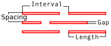
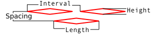
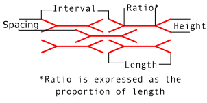
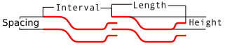

# Inkscape lasercut lattice hinge extension

This is an extension for Inkscape to render Lattice Hinges.

Lattice hinges are patterns that can be laser cut into materials such
as wood and acrylic, allowing them to be bent into surprisingly tight
radii.

This extension is primarily built for Inkscape 1.0 and above.

For version 0.92 there is also a port in the Github `0.92` branch.

## Installation

### Inkscape 1.0+

Download the archive and extract it such that all of the files are
contained in a *sub-folder* of your extensions folder.

Your extensions folder can be found at `Edit->Preferences->System->User Extensions`

On Linux, this is usually:

`~/.config/inkscape/extensions`

On windows it's usually:

`c:\Users\<username>\AppData\Roaming\inkscape/extensions`

### Inkscape 0.92

You will need to download the archive from the Github `0.92` branch.

Download that archive, and extract the files `lattice_hinge.inx` and
`lattice_hinge.py` into your extensions folder (see above for the location).

## Usage

The extension is found in `Extensions->Render->Lattice Hinge...`

Choose the type of pattern you'd like by selecting its tab. Adjust the
parameters as needed. Input the width and height of the desired pattern
and then apply (or live preview).

To get a better bounding box by the edge, you can draw a bounding path
around the desired area afterwards, then select `Path->Intersection`
to limit the pattern to exactly that path.

## Patterns

The currently supported patterns are:

Straight lattice:

Diamond lattice:

Honeycomb lattice:

Wavy Lattice:

## Contributions

Contributions are welcome, such as for more or improved patterns, etc.

## Licence and contact

Author: Ben Buxton (bbuxton@gmail.com)
Licence: GPLv3
